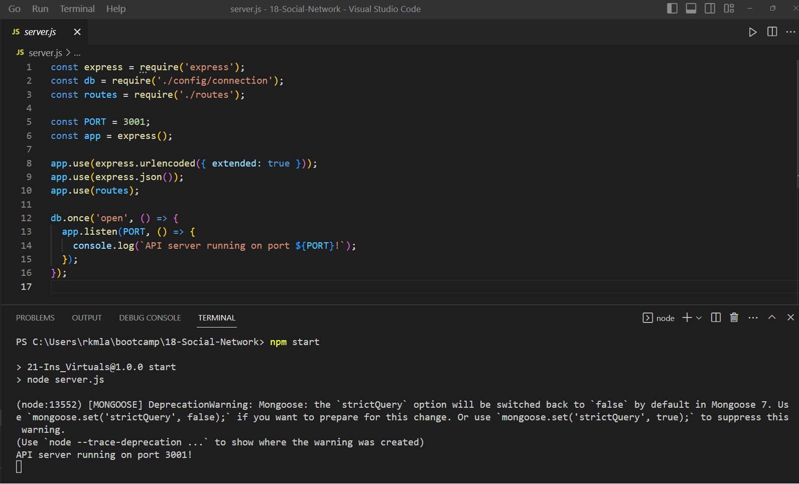
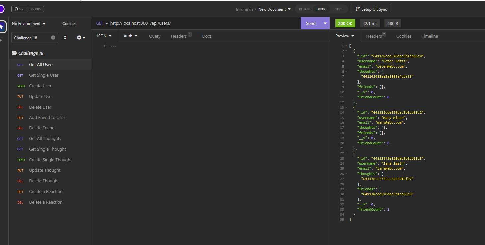

# My Social Network 

## Description

This is an application to create the API for a new social network web application that allows users to share their thoughts, create a friends list & react to their friends' thoughts!   

Things I learned from this application:
- Relation between Express.js, NoSQL and MongoDB 
- MongoDB ODM
- The separation of routes & controllers 
- The creation of MongoDB database & collections  
- Creation of the new type of schema for NoSQL 
- Gained even more understanding of how to use Insomnia to test API routes 

  ## Table of Contents 
  - [Installation](#installation)
  - [Usage](#usage)
   - [License](#license)
   - [Contributing](#contributing)
   - [Test](#test)
   - [Questions](#questions)

## Installation

The following images provide a walkthrough on how to use the application.

Download the repo from https://github.com/rkml14/18-Social-Network, and run the command prompt: npm i to create the package-lock.json 

Run the application via the terminal using the command prompt: npm start and use Insomnia to test the API routes   

## Usage

<a href = "https://drive.google.com/file/d/12qdrqdnQznSsDF6bkCdWcbLXSaN5gOjF/view"> A walkthrough video is available!  </a> 

In the terminal, using the command prompt: npm start

Open Insomnia to test the various API routes:

/api/users
* To get all users & to create a single user

/api/users/:userId
* To get, update or delete a single user

/api/users/:userId/friends/:friendId 
* To add or delete a friend

/api/thoughts
* To get all thoughts or create a single thought

/api/thoughts/:thoughtId
* To get, update or delete a single thought

/api/thoughts/:thoughtId/reactions
* To add a reaction

/api/thoughts/:thoughtId/reactions/:reactionId
* To delete a reactionon 

## Contributing
If you would like to contribute to this application, please reach out to me via one of the means listed under Questions.

## Tests 
All tests were conducted in Insomnia 

A small gif of a couple of the tests able to be performed: 

## Credits

My favourite study buddy: <a href = "https://github.com/cassiewatsonn">Cassandra Watson </a>  

My most amazing tutor: Dominique Meeks Gombe 

And a big thank you to the 11:59pm Gang for the last minute help with debugging the one controller!  <a href = "https://github.com/Connor812">Connor Savoy </a> & <a href = "https://github.com/omgthegreenranger">Steve Cardie</a>

## License

MIT License 

## Questions

If you have any questions regarding this application, please contact me via one of the means below:

GitHub: <a href = "https://github.com/rkml14">Rebecca Lawrence </a>   
rkmlawrence@gmail.com  